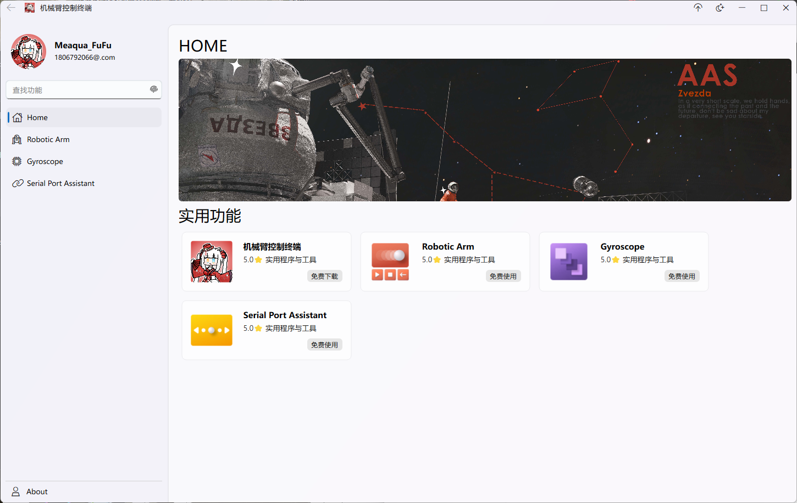
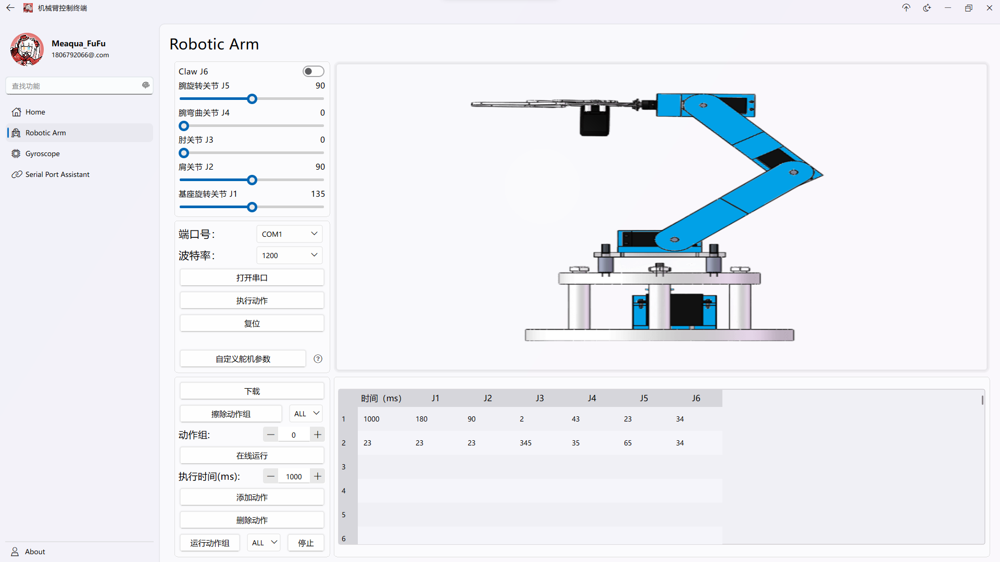
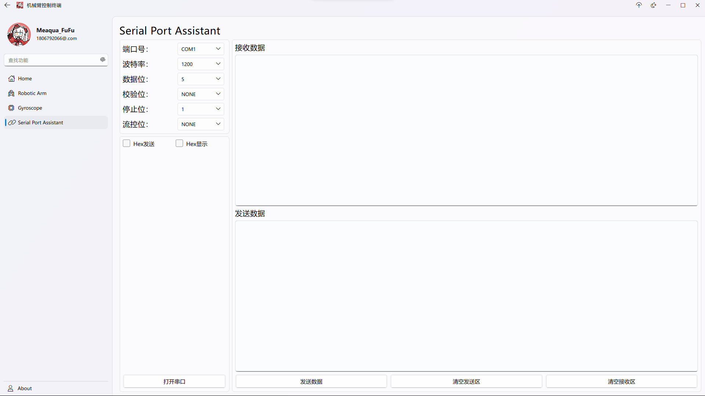

# RoboticArmControlTerminal
 机械臂控制终端 QT6.6.3

UI库：[ElaWidgets](https://github.com/Liniyous/ElaWidgetTools)

QT版本：6.6.3

编译器：MSVC2019 or MinGW

构建系统：CMake

通信模块使用了策略模式进行设计，用QtConcurrent做的多线程。

🚨陀螺仪界面未完成

🚨自定义机械臂参数即其帮助界面未完成
